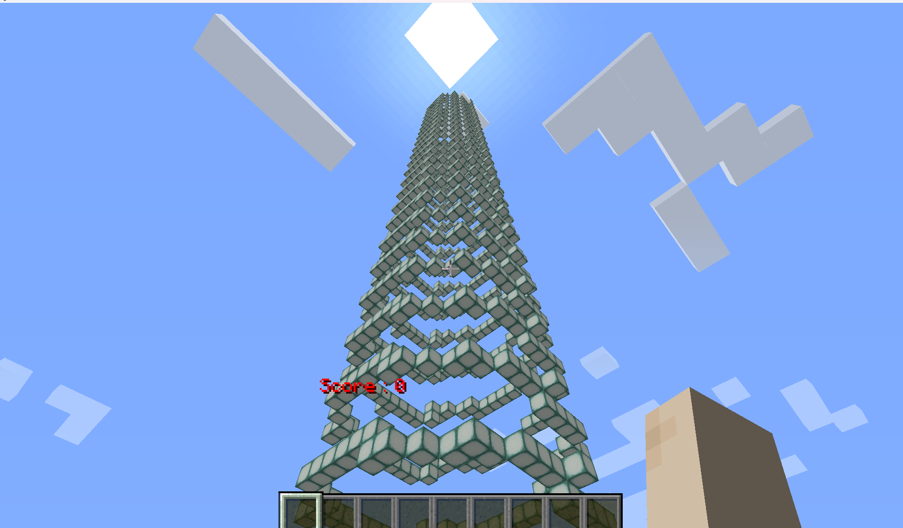
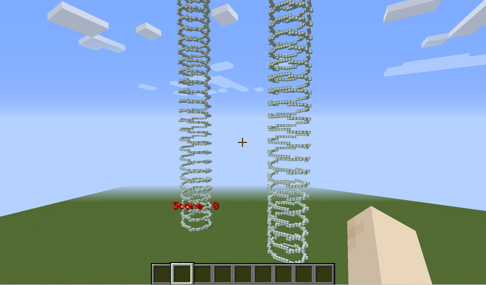
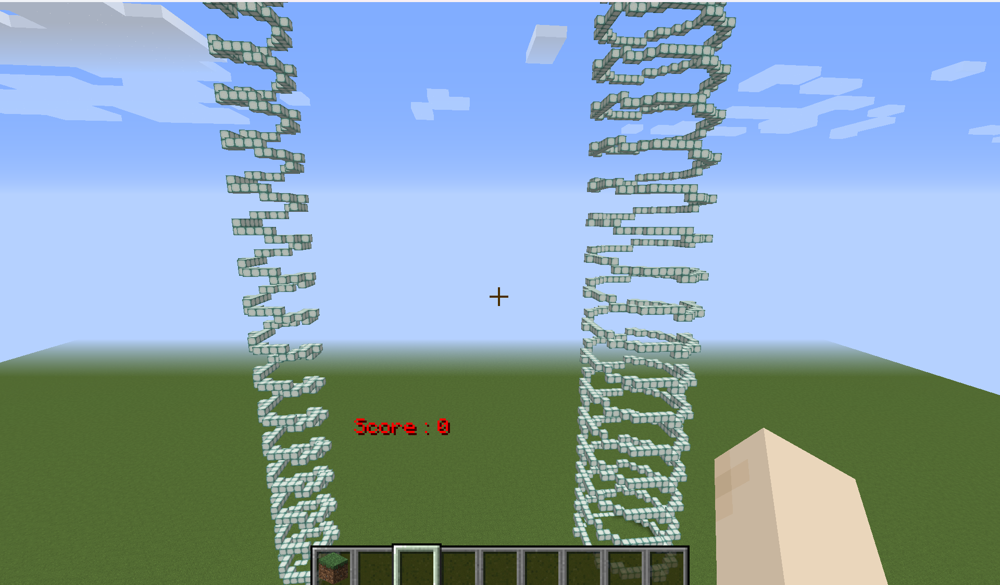
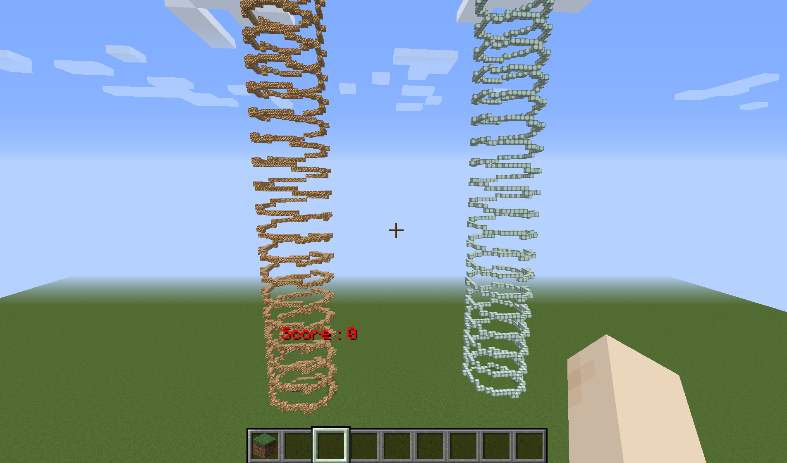
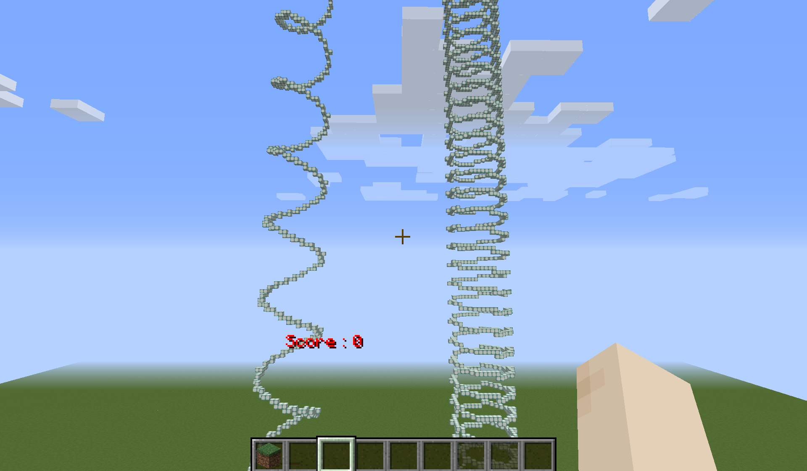

# らせん状にブロックを置く

## できること

- ブロックの種類の指定

- 半径の指定

- 位置の指定

- 縦幅の指定

## 実行してみる

[](./images/rasen_start.png.png)   

下から上に向かってらせん状にブロックが積みあがっていきました。


### 位置の指定

14行目の

`MC_X0, MC_Y0, MC_Z0 = -100, -80, 5`

の数値の部分を変更することで位置を指定できます。左からX座標、Y座標、Z座標になっています。

[](./images/rasen2.png.png)   

上の画像ではX座標を変えてみました。

### 半径の変更

35行目にある

`r = 8`

の数値の部分が半径になります。

[](./images/rasen2.png.png)   

上の画像では、左が半径4ブロック、右が半径8ブロックで作りました。

### ブロックの種類の変更

15行目から18行目に

```
color_on_mc = param.SEA_LANTERN_BLOCK

color_off_mc = param.AIR
```

と宣言されています。`param.`の後の部分を好きなブロックに変えることで、ブロックの種類を変更することができます。

[](./images/rasen2.png.png)   

画像では先ほど使っていたシーランタンと、グロウストーンで作りました。

また、color_off_mc、を使う場合は

70行目の

` draw_train_mc(start=theta - length, draw_length=speed, dy=dy, color=color_on_mc)`

75行目の

`draw_train_mc(start=theta, draw_length=speed, dy=dy, color=color_on_mc)`

の`color_on_mc`の部分を`color_off_mc`に置き換える必要があります。

### 縦幅の指定

39行目の

`dy = 5`

というところでブロックの縦の幅を指定できます。

[](./images/rasen5.png.png)   


## 今後やりたいこと

- 横向きでもできるようにする

- 二本同時に出す

- 途中で進行方向を変化させる
